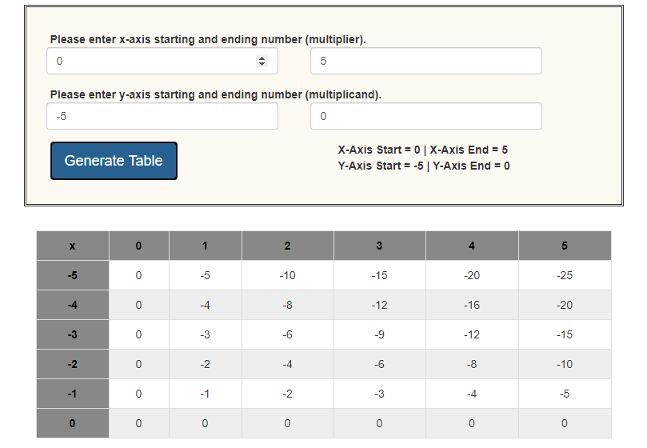

# 
 Homework 5 - JavaScript 

### 
Creating an Interactive Dynamic Table 

<b>Check the page out at:</b> https://alexbochman.github.io/Homework/HW5/Homework5.html 
   

#### Overview

>Create a table dynamically based on parameters entered in an HTML form. First, a form is created that accepts the starting and ending numbers for both the horizontal (multiplier) and vertical (multiplicand) axes of a multiplication table. Second, numbers entered into the form create a multiplication table dynamically. This is what is commonly called a “single page web app” (or application). To start, enter in four numbers within the range of -50 to 50 and then click the "Generate Table" button.

                  

